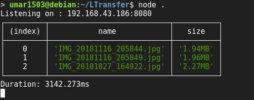

# LTransfer

A small and robust script written in Node.js to help you transfer files between devices connected over your local network.

## Instructions for Use :
- Download this repository
- cd into the folder and run `npm install`
- run `node .`

## Contributing
This project is in nascent stage and contributions are very welcome. There are a lot of things to be done. I will be listing down how you can contribute based on the technology you know -

- [ ] UI : There is currently no UI except for a html form to submit the files. I would prefer React for it but if you want to go with something else file an issue and we can discuss about it.
- [ ] Backend : Support to set transfered files destination.
- [ ] Security : Allow only the authorized devices to share the files.

We can further enhance the user experience by using Port 80 so the user doesn't have to enter the port number in the URL. The script can also be added to the `PATH` enabling you to run it instantly from the terminal.
